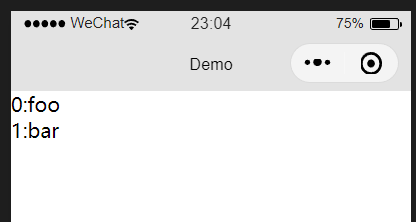
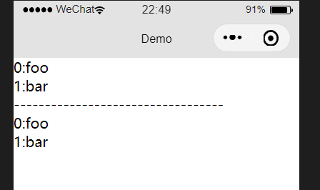

# 小程序基本语法

## WXML语法
### 一、数据绑定
WXML中的动态数据都是来自对应的 Page 的 data 。

数据绑定使用 Mustache 语法，也就是双大括号将变量包括起来

**文本内容**

    <view> {{msg}} </view>
****
    Page:({
      data:{
        msg: 'Hello World'
      }
    })

**组件属性(需要在双引号之内)**

    <view id="{{id}}"> </view>
****
    Page({
      data: {
        id: 1
      }
    })

**控制属性(需要在双引号之内)**

    <view wx:if="{{flag}}"></view>
****
    Page(
      {
        data:{
          flag: true
        }
      }
    )

**关键字(需要在双引号之内)**

true：boolean 类型的 true，代表真值。false： boolean 类型的 false，代表假值。

    <checkbox checked="{{false}}"></checkbox>

特别注意：不要直接写 checked="false"，其计算结果是一个字符串，转成 boolean 类型后代表真值。

**组合**

还可以在Mustache内直接进行组合，构成新的对象或者数组。

数组

    <view wx:for="{{ [zero,1,2,3,4] }}">{{item}}</view>
****
    Page({
      data:{
        zero: 0
      }
    })
    
    组合成数组 [0,1,2,3,4]

对象

    Page({
      data:{
        a: 1,
        b: 2
      }
    })
****
    <template is="objectCombine" data="{{for: a, bar: b}}"></template>
    
    组合成的对象是 {for: 1, bar: 2}

也可以使用扩展运算符 `...` 来将一个对象展开

    <template is="objectCombine" data="{{ ...obj1,...obj2, e:5}}"></template>
****
    Page({
      data:{
        obj1:{
          a: 1,
          b: 2  
        },
        obj2:{
          c: 3,
          d: 4
        }
      }
    })
    
    合成的对象是 `{a:1,b:2,c:3,d:4,e:5}`

如果对象的 key 和 value 相同，也可以间接的表达

    <template is="objectCombine" data="{{a,b}}"></template>
****
    Page({
      data:{
        a:'hello',
        b:'world'
      }
    })
    
    组合成的对象是 `{a:hello, b:world}`


> 注意：上述方式可以随意组合，但是如有存在变量名相同的情况，后边的会覆盖前面。

> 注意：花括号和引号之间如果有空格，将最终被解析成为字符串

    <view wx:for="{{[1,2,3]}} ">
      {{item}}
    </view>
    
    //等同于
    
    <view wx:for="{{[1,2,3] + ' '}}">
      {{item}}
    </view>

### 二、列表渲染

在组件上使用 `wx:for` 控制属性绑定一个数组，即可使用数组中各项的数据重复渲染该组件。

默认数组的当前项的下标变量名默认为 `index`，数组当前项的变量名默认为 `item`

```html
<view wx:for="{{array}}">
	{{index}}:{{item.message}}
</view>
```

```javascript
page({
  data:{
    array:[
      {message:'foo'},
      {message:'bar'}
    ]
  }
})
```



使用`wx:for-item`可以指定数组当前元素的变量名，使用`wx:for-index`可以指定数组当前下标的变量名。也就是起别名。还是以上面的数组`array`为例：

```html
<view wx:for="{{array}}" wx:for-index="id" wx:for-item="value">
	{{id}}:{{value.message}}
</view>
```



`wx:for` 也可以嵌套，下边是一个九九乘法表

```
<view wx:for="{{[1,2,3,4,5,6,7,8,9]}}" wx:for-item="i">
  <view wx:for="{{[1,2,3,4,5,6,7,8,9]}}" wx:for-item="j">
    <view wx:if="{{i <= j}}">
      {{i}} * {{j}} = {{i*j}}
    </view>
  </view>
</view>
```

**` wx:key` 来指定数组中唯一的标识符**

`wx:key` 的值以两种形式提供：

1、字符串--代表在for循环的array中 item 的某个property，该property的值需要是array中唯一的字符串或数字，且不能动态改变。

2、保留关键字 *this ，代表在for循环中的item本身（需要item本身是一个唯一的字符串或者数字）

**如不提供 `wx:key`，会报一个 `warning`， 如果明确知道该列表是静态，或者不必关注其顺序，可以选择忽略。**

> 注意：当 wx:for 的值为字符串时，会将字符串解析成字符串数组
>
> ```html
> <view wx:for="array">
>   {{item}}
> </view>
> ```
>
> 等同于
>
> ```html
> <view wx:for="{{['a','r','r','a','y']}}">
>   {{item}}
> </view>
> ```
>
> 

### 三、条件渲染

**wx:if**

在框架中，使用`wx:if`来判断是否需要渲染该代码块

```html
<view wx:if="{{condition}}"> true</view>
```

也可以用 `wx:elif` 和 `wx:else` 来添加一个 else 块：

```html
<view wx:if="{{length > 5}}"> 1 </view>
<view wx:elif="{{length > 2}}"> 2 </view>
<view wx:else> 3 </view>
```

因为 `wx:if` 是一个控制属性，需要将它添加到一个标签上。如果要一次性判断多个组件标签，可以使用一个 `` 标签将多个组件包装起来，并在上边使用 `wx:if` 控制属性。

```html
<block wx:if="{{true}}">
	<view>1</view>
  <view>2</view>
</block>
```

> **注意：** `<block>` 并不是一个组件，它仅仅是一个包装元素，不会在页面中做任何渲染，只接受控制属性。

> **wx:if vs hidden**

> 因为 `wx:if` 之中的模板也可能包含数据绑定，所以当 `wx:if` 的条件值切换时，框架有一个局部渲染的过程，因为它会确保条件块在切换时销毁或重新渲染。
>
> 同时 `wx:if` 也是**惰性的**，如果初始渲染条件为 `false`，框架什么也不做，在条件第一次变成真时才开始局部渲染。
>
> 相比之下，`hidden` 就简单的多，组件始终会被渲染，只是简单的控制显示与隐藏。
>
> 一般来说，`wx:if` 有更高的切换消耗而 `hidden` 有更高的初始渲染消耗。因此，如果需要频繁切换的情景下，用 `hidden` 更好，如果在运行时条件不大可能改变则 `wx:if` 较好。

### 四、模板

1、什么是模板

模板即`template` --可以在模板中定义代码片段，然后在不同的地方调用。

2、定义模板

使用`name`属性，作为模板的名字。然后在`<template/>`内定义代码片段

```php+HTML
<template name="myTemplate">
	<view>
  	<text>{{index}}: {{msg}}</text>
  	<text>time: {{time}}</text>
  </view>
</template>
```

3、使用模板

使用`is`属性，声明需要使用的模板，然后将模板所需要的`data`传入

```html
<template is="myTemplate" data="{{...item}}"></template>
```

```javascript
Page({
  data:{
    item:{
      index:0,
      msg:'这是我的模板',
      time: '2020-4-10'
    }
  }
})
```

> 注意：`is`属性可以使用 Mustache 语法，来动态决定具体需要渲染哪个模板：

```html
<template name="odd">
  <view> odd </view>
</template>
<template name="even">
  <view> even </view>
</template>

<block wx:for="{{[1, 2, 3, 4, 5]}}">
  <template is="{{item % 2 == 0 ? 'even' : 'odd'}}"/>
</block>
```

4、模板的作用域

模板有自己的作用域，只能使用`data`传入的数据以及模板定义文件中定义的`<wxs />`模块

### 五、引用

WXML 提供两种文件引用方式`import`和`include`。

#### 1、import

`import`可以在该文件中使用目标文件定义的`template`，如：

在 item.wxml 中定义一个叫`item`的`template`：

```html
item.wxml
<template name="item">
	<text>{{text}}</text>
</template>
```

在 index.wxml 中引用 item.wxml，就可以使用`item`模板：

```html
index.wxml
<import src="item.wxml" />
<template is="item" data="{{text: 'items'}}" />

```

#### 2、import 的作用域

import 有作用域的概念，即只会 import 目标文件中定义的 template，而不会 import 目标文件 import 的 template。

**如：C import B，B import A，在C中可以使用B定义的`template`，在B中可以使用A定义的`template`，但是C不能使用A定义的`template`**。

#### 3、include

`include` 可以将目标文件**除了** `<template>` `<wxs>`外的整个代码引入，相当于是将目标文件拷贝到 `include` 位置显示。`src`是引用的文件路径

```html
<!-- header.wxml文件 -->
<view>我是header</view>
```

```html
<!-- footer.wxml文件 -->
<view>我是footer</view>
```


```html
<!-- index.wxml -->
<include src="header.wxml"/> <!-- 引入header.wxml -->
<view> 我是body </view>
<include src="footer.wxml"/> <!-- 引入footer.wxml -->
```

